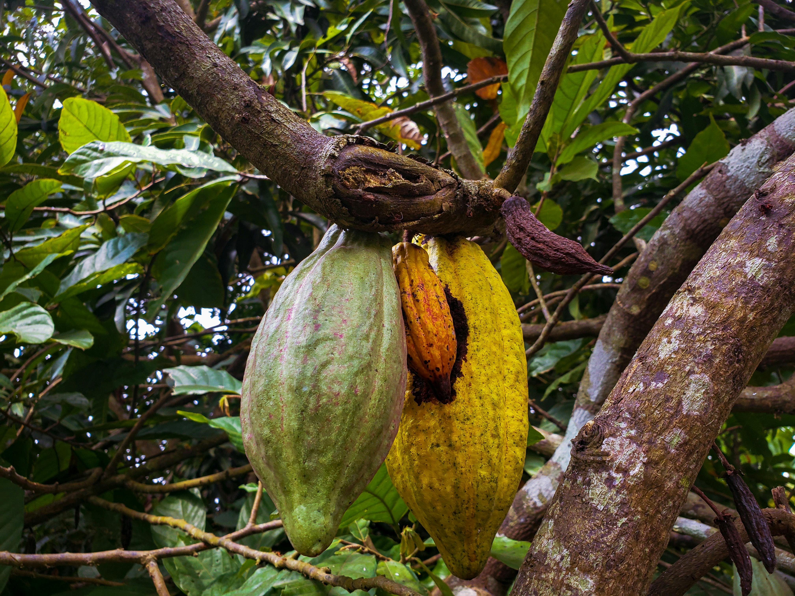

#+title: Readme | cacaoML
#+author: Matthew Younger - Pledged

#+attr_html: :alt  :align left :class img

* Overview:

  There exists an abundance of climate data from NOAA, corresponding to yearly per-country summaries of cacao exportation courtesy of the United Nations.
  The volume and quality of the data suggests this is a good candidate for machine learning. i.e. A model could be trained to predict
  each region's production capacity for future years. Given the high potential for market disruption in the underdeveloped nations where this crop is grown,
  metrics and predictions such as these can give useful insights to help the industry cope with its many challenges.

** DONE Stage 1
DEADLINE: <2025-02-07 Fri>
*** [X] Overview Description and Goals
*** [X] Gather initial data for project

** DONE Stage 2
DEADLINE: <2025-03-07 Fri>
*** [X] Conduct basic analysis to determine ML approach?
*** [X] Gather Research
*** [X] Utilize NotebookLM to gather insights from other scholarly articles
*** [X] Write Literature Review

** DONE Stage 3
*** [X] Write Abstract

** DONE Stage 4
*** [X] Present findings

* Goal:

- Develop a predictive model using quality data [cite:@GSOM_V1] sourced near popular grow sites for Cacao,
  which could could be used in tandem with the UN FAO data [cite:@UN_FAO] to make intelligent predictions about future yield, and indirectly influence decisions on a local level, much like an almanac.

- As a complimentary goal, this work seeks to investigate (per its creation) and demonstrate the merits of its transparent composition style:
  1. *literate programming*
     - per the [[https://en.wikipedia.org/wiki/Literate_programming][Wikipedia Description]], the emphasis is ensuring the code,
       which is supporting the conclusion of the piece, is readily examined for reliability.

  2. *version control & immutability*
     Every well-established news source maintains errata. I believe that in this brave new world, we normalise the use case of Git to other frontiers.

  3. *Open-source software*
     There are several reasons to embrace [[https://en.wikipedia.org/wiki/Open-source_software][open-source software]] in research,
     not least of which is ensuring the widest-possible access to its conclusions which may have global implications.
     FOSS software ensures the best chances of avoiding pay walls and hefty license fees, or obsolesence.

     In the worst-case scenario, at least the source code for the necessary applications will remain available and not be buried
     with the company at some future date.

  4. *Plaintext data*
     Technology changes at a rapid pace. Without knowing how data will be accessed in the future (web-based HTML, PDF, VR, etc),
     plaintext seems the best long-term option to ensure that whatever comes to pass, this data could be readily parsed into
     whatever Lingua Franca presents itself later-on.

  5. *Stable visual insights (PNGs, JPEGs, etc)*
     With similar sentiment, while interactive charts and graphs are wonderful for illustrative purposes, they are also very sensitive
     to change. Minor browser bugs and obsolesence of code libraries is an enemy to long-term viability of such tools.

  6. *Community Engagement*
     Stemming from the previous points, this final point is offered as a means to help recover the global community's trust in reporting, which is at an all-time low.
