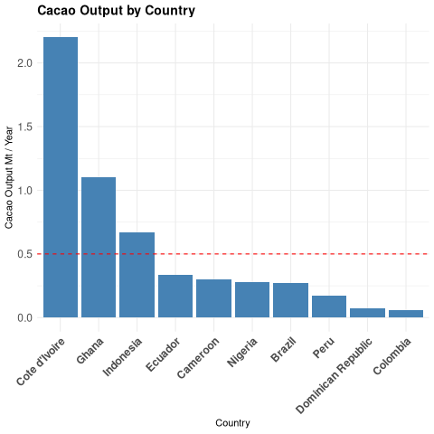

#+title: Cacao Climate Change Study
#+author: Matthew Younger - Pledged
#+STARTUP: overview hideblocks indent
#+PROPERTY: header-args:R :session *R* :results output :exports both :noweb yes
#+bibliography: references.bib

* Introduction:

** Hypothesis:
- Localized climate is affecting Cacao crops in the target countries.
- Other variables may be at play...
  - Demographic changes
  - Blight or disease
** Cacao Production by Country:

#+begin_src R :results output

# Load library dependencies:
library(tidyverse)

# Primary countries of interest:
country <- c("Cote d'Ivoire", "Indonesia", "Ecuador", "Brazil", "Peru",
             "Dominican Republic", "Colombia", "Cameroon", "Nigeria", "Ghana")

# Output in metric Tonnes (1000 kg)
output <- c(2200000, 667000, 337000, 274000,
            171000, 76000, 62000, 300000,
            280000, 1100000)

# Let's convert to million Tonnes for readability
output <- output / (1 * 10**6)

# Create a dataframe:
cacao <- data.frame(Country=country, Production=output)

# Calculate mean output:
mean_output <- round(mean(cacao$Production), digits=1)

# Transparency...
print("Mean Output (Mt):")
mean_output
#+end_src

#+RESULTS:
: [1] "Mean Output (Mt):"
: [1] 0.5

[cite:@VC-Cacao-Data]

*** Production Visualization:
#+begin_src R :results graphics file :file ./images/output_by_country.png
ggplot(cacao, aes(x=reorder(Country, -Production), y=Production)) +
  geom_col(fill="steelblue") +
  labs(x="Country", y="Cacao Output Mt / Year",
       title="Cacao Output by Country") +
  geom_hline(yintercept=mean(mean_output), linetype="dashed", color="red") +
  theme_minimal() +
  theme(
    axis.text.x = element_text(angle=45, hjust=1, size=12, face="bold"),
    axis.text.y = element_text(size=12),
    plot.title = element_text(size=14, face="bold"))
#+end_src

#+RESULTS:
 bi

#+begin_comment
Interestingly, [[https://en.wikipedia.org/wiki/Theobroma_cacao][Theobroma cacao]], though originally native to the American tropics, is primarily produced in West Africa and Southeast Asia. All other cacao-producing countries fall significantly below the average per-country output.

Though Wikipedia readily states this fact, the data shows just this is more disproportionate than might be expected.

This is a significant finding from the early data: ~the future of cocoa hinges on three countries.~
#+end_comment
*** Digging Deeper:

For the sake of reducing ~out-of-sample data~ we need to reduce our weather data to the sub-regions of each country in question

NOAA's dataset is providing Global Summary of the Month data...

| Country            | City        | Dataset     |
|--------------------+-------------+-------------|
| Indonesia          | Makassar    | IDM00097180 |
| Cote d'Ivoire      | San Pedro   | IVM00065594 |
| Ghana              | Kumasi      | GHM00065442 |
| Ecuador            | Guayaquil   | ECM00084226 |
| Cameroon           | Buea        | CM000004910 |
| Nigeria            | Ibadan      | NIM00065201 |
| Brazil             | Ilhéus      | BR048916940 |
| Peru               | Tarapoto    | PE000084455 |
| Dominican Republic | Santiago    | DRM00078458 |
| Colombia           | San Vicente | CM000004910 |

[cite:@GSOM_V1]
