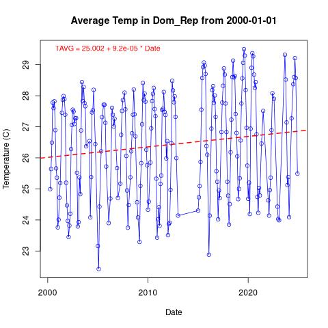
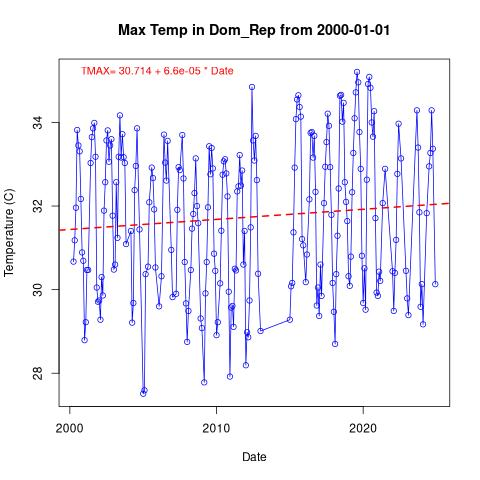
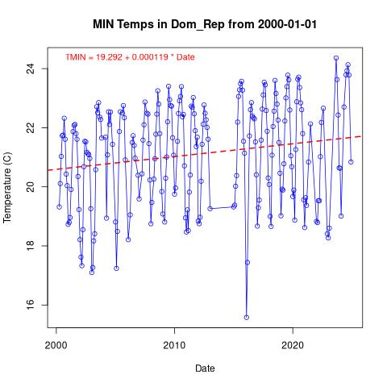
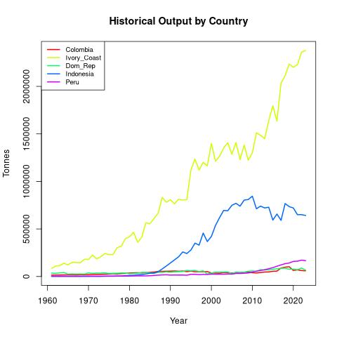

#+title: Cacao Climate Change Study
#+author: Matthew Younger - Pledged
#+STARTUP: overview hideblocks indent
#+PROPERTY: header-args:R :session *R* :results output :exports both :noweb yes
#+bibliography: references.bib

* Introduction:

** Hypothesis:
- Localized climate is affecting Cacao crops in the target countries.
- Other variables may be at play...
  - Demographic changes
  - Blight or disease

** Overview - Cacao Production by Country:

#+begin_src R :results output

# Load library dependencies:
library(tidyverse)

# Primary countries of interest:
country <- c("Cote d'Ivoire", "Indonesia", "Ecuador", "Brazil", "Peru",
             "Dominican Republic", "Colombia", "Cameroon", "Nigeria")

# Output in metric Tonnes (1000 kg)
output <- c(2200000, 667000, 337000, 274000,
            171000, 76000, 62000, 300000,
            280000)

# Let's convert to million Tonnes for readability
output <- output / (1 * 10**6)

# Create a dataframe:
cacao <- data.frame(Country=country, Production=output)

# Calculate mean output:
mean_output <- round(mean(cacao$Production), digits=1)

# Transparency...
print("Mean Output (Mt):")
mean_output
#+end_src

#+RESULTS:
#+begin_example
── Attaching core tidyverse packages ────────────────────────────────────────────────────────────── tidyverse 2.0.0 ──
✔ dplyr     1.1.4     ✔ readr     2.1.5
✔ forcats   1.0.0     ✔ stringr   1.5.1
✔ ggplot2   3.5.1     ✔ tibble    3.2.1
✔ lubridate 1.9.4     ✔ tidyr     1.3.1
✔ purrr     1.0.2
── Conflicts ──────────────────────────────────────────────────────────────────────────────── tidyverse_conflicts() ──
✖ dplyr::filter() masks stats::filter()
✖ dplyr::lag()    masks stats::lag()
ℹ Use the ]8;;http://conflicted.r-lib.org/conflicted package]8;; to force all conflicts to become errors
[1] "Mean Output (Mt):"
[1] 0.5
#+end_example

[cite:@VC-Cacao-Data]

*** Production Visualization:
#+begin_src R :results graphics file :file ./images/output_by_country.png
ggplot(cacao, aes(x=reorder(Country, -Production), y=Production)) +
  geom_col(fill="steelblue") +
  labs(x="Country", y="Cacao Output Mt / Year",
       title="Cacao Output by Country") +
  geom_hline(yintercept=mean(mean_output), linetype="dashed", color="red") +
  theme_minimal() +
  theme(
    axis.text.x = element_text(angle=45, hjust=1, size=12, face="bold"),
    axis.text.y = element_text(size=12),
    plot.title = element_text(size=14, face="bold"))
#+end_src

#+RESULTS:
[[file:./images/output_by_country.png]]

#+begin_comment
Interestingly, [[https://en.wikipedia.org/wiki/Theobroma_cacao][Theobroma cacao]], though originally native to the American tropics, is primarily produced in West Africa and Southeast Asia. All other cacao-producing countries fall significantly below the average per-country output.

Though Wikipedia readily states this fact, the data shows just this is more disproportionate than might be expected.

This is a significant finding from the early data: ~the future of cocoa hinges on three countries.~
#+end_comment

*** Digging Deeper:

For the sake of reducing ~out-of-sample data~ we need to reduce our weather data to the sub-regions of each country in question

NOAA's dataset is providing Global Summary of the Month data...

| Country            | City        | Dataset     |
|--------------------+-------------+-------------|
| Indonesia          | Makassar    | IDM00097180 |
| Cote d'Ivoire      | San Pedro   | IVM00065594 |
| Ghana              | Kumasi      | GHM00065442 |
| Ecuador            | Guayaquil   | ECM00084226 |
| Cameroon           | Buea        | CM000004910 |
| Nigeria            | Ibadan      | NIM00065201 |
| Brazil             | Ilhéus      | BR048916940 |
| Peru               | Tarapoto    | PE000084455 |
| Dominican Republic | Santiago    | DRM00078458 |
| Colombia           | San Vicente | CM000004910 |

[cite:@GSOM_V1]

* Exploring our collected data
** Loading the Data:
1. Load the cleaned data from saved session:
   As we've learned, loading a saved .RData session is the best way to ensure the methods and processes hereafter are repeatable.

   #+begin_src R :results silent
     # Load the climate data from the RData file:
     load("datasets/cleaned_climate_data.RData")
     str(df_combined)
   #+end_src

2. After a long process of cleaning the data and getting some basic insights, we know the following:
   - Just because a source is reputable does not mean the data will be quality.
     Though I'm unsure why, I found that the NOAA datasets I obtained for the project had a lot of NA values.
     I'm not sure yet what the impact of this will be, though I've found that most ML models don't fare well with missing values, so imputation will be neccesary.

     Of the data gathered, the Dominican Republic data is most complete where temperature data is concerned.

   - If I continue this project in the future, I'd get in contact with NOAA and inquire about more complete data. I find it hard to believe there's as much missing data as there is.

** Graphing Initial Climate Data:

- For quality *TAVG* data, ~Dominican Republic~ had the most complete data:

  #+begin_src R :results file graphics :file graphics/dom_rep_tavg.jpg
  # Country we are interested in
  #"Colombia" -> country
  #"Ivory_Coast" -> country
  "Dom_Rep" -> country
  #"Indonesia" -> country
  #"Peru" -> country

  # Define how far back we're looking at:
  "2000-01-01" -> date_cutoff

  # Select date criterion
  climate_data <- subset(df_combined, STATION == country & DATE >= as.Date(date_cutoff))
  # Order by date oldest -> newest
  climate_data <- climate_data[order(climate_data$DATE), ]

  temp_model <- lm(TAVG ~ as.numeric(DATE), data = climate_data)
  coeffs <- coef(temp_model)
  intercept <- round(coeffs[1], 3)
  slope <- round(coeffs[2], 6)  # Smaller number, usually

  # Define ylab limits:
  y_min <- min(climate_data$TAVG, na.rm = TRUE)
  y_max <- max(climate_data$TAVG, na.rm = TRUE)

  plot_title <-
  plot(x = climate_data$DATE, y = climate_data$TAVG,
       type = "o",
       col = "blue",
       xlab = "Date",
       ylab = "Temperature (C)",
       ylim = c(y_min, y_max),
       main = paste0("Average Temp in ", country, " from ", date_cutoff)
       )

  abline(temp_model, col = "red", lwd = 2, lty = 2)  # Dashed red trend line

  eqn <- paste("TAVG =", intercept, "+", slope, "* Date")
  text(x = min(climate_data$DATE),
       y = max(climate_data$TAVG),
       labels = eqn,
       pos = 4, col = "red", cex = 0.9)
  #+end_src

  #+RESULTS:
  

- *TMAX* had more complete data overall:
  (with exception of Peru...)

  #+begin_src R :results file graphics :file graphics/dom_rep_tmax.jpg
  # Country we are interested in
  #"Colombia" -> country
  #"Ivory_Coast" -> country
  "Dom_Rep" -> country
  #"Indonesia" -> country
  #"Peru" -> country

  # Define how far back we're looking at:
  "2000-01-01" -> date_cutoff

  # Select date criterion
  climate_data <- subset(df_combined, STATION == country & DATE >= as.Date(date_cutoff))
  # Order by date oldest -> newest
  climate_data <- climate_data[order(climate_data$DATE), ]

  temp_model <- lm(TMAX ~ as.numeric(DATE), data = climate_data)
  coeffs <- coef(temp_model)
  intercept <- round(coeffs[1], 3)
  slope <- round(coeffs[2], 6)  # Smaller number, usually

  # Define ylab limits:
  y_min <- min(climate_data$TMAX, na.rm = TRUE)
  y_max <- max(climate_data$TMAX, na.rm = TRUE)

  plot_title <-
  plot(x = climate_data$DATE, y = climate_data$TMAX,
       type = "o",
       col = "blue",
       xlab = "Date",
       ylab = "Temperature (C)",
       ylim = c(y_min, y_max),
       main = paste0("Max Temp in ", country, " from ", date_cutoff)
       )

  abline(temp_model, col = "red", lwd = 2, lty = 2)  # Dashed red trend line

  eqn <- paste("TMAX=", intercept, "+", slope, "* Date")
  text(x = min(climate_data$DATE),
       y = max(climate_data$TMAX),
       labels = eqn,
       pos = 4, col = "red", cex = 0.9)
  #+end_src

  #+RESULTS:
  

- *TMIN* data for ~Dominican Republic~

  #+begin_src R :results file graphics :file graphics/dom_rep_tmin.jpg
  # Country we are interested in
  #"Colombia" -> country
  #"Ivory_Coast" -> country
  "Dom_Rep" -> country
  #"Indonesia" -> country
  #"Peru" -> country

  # Define how far back we're looking at:
  "2000-01-01" -> date_cutoff

  # Select date criterion
  climate_data <- subset(df_combined, STATION == country & DATE >= as.Date(date_cutoff))
  # Order by date oldest -> newest
  climate_data <- climate_data[order(climate_data$DATE), ]

  temp_model <- lm(TMIN~ as.numeric(DATE), data = climate_data)
  coeffs <- coef(temp_model)
  intercept <- round(coeffs[1], 3)
  slope <- round(coeffs[2], 6)  # Smaller number, usually

  # Define ylab limits:
  y_min <- min(climate_data$TMIN, na.rm = TRUE)
  y_max <- max(climate_data$TMIN, na.rm = TRUE)

  plot_title <-
  plot(x = climate_data$DATE, y = climate_data$TMIN,
       type = "o",
       col = "blue",
       xlab = "Date",
       ylab = "Temperature (C)",
       ylim = c(y_min, y_max),
       main = paste0("MIN Temps in ", country, " from ", date_cutoff)
       )

  abline(temp_model, col = "red", lwd = 2, lty = 2)  # Dashed red trend line

  eqn <- paste("TMIN =", intercept, "+", slope, "* Date")
  text(x = min(climate_data$DATE),
       y = max(climate_data$TMIN),
       labels = eqn,
       pos = 4, col = "red", cex = 0.9)
  #+end_src

  #+RESULTS:
  

** Visualizing year-over-year production

#+begin_src R  :results file graphics :file graphics/all_countries_yearly_out.jpg
df <- read.csv("datasets/crop_data_tonnes.csv", header = TRUE)

# Sort by Year just to be safe
df <- df[order(df$Year), ]

# Get all countries
countries <- unique(df$Area)

# Set up a color palette with one color per country
colors <- rainbow(length(countries))

# Plot the first country
first_country <- countries[1]
first_data <- df[df$Area == first_country, ]

plot(first_data$Year, first_data$Tonnes, type = "l",
     col = colors[1], lwd = 2,
     xlab = "Year", ylab = "Tonnes",
     main = "Historical Output by Country",
     ylim = range(df$Tonnes, na.rm = TRUE))

# Draw the rest of the countries
for (i in 2:length(countries)) {
  country_data <- df[df$Area == countries[i], ]
  lines(country_data$Year, country_data$Tonnes,
        col = colors[i], lwd = 2)
}

# Add a legend with matching colors and labels
legend("topleft", legend = countries,
       col = colors, lty = 1, lwd = 2, cex = 0.8)

#+end_src

#+RESULTS:

* Define test and training data
#+begin_src R :results silent
set.seed(123)  # for reproducibility when using sample()

# Setting a proportion of 3/4 training data 1/4 test data
train_proportion <- 0.75

# Define the index based off the proportions defined above
train_index <- sample(seq_len(nrow(df_combined)), size = floor(train_proportion * nrow(df_combined)))

train_data <- df_combined[train_index, ]
test_data <- df_combined[-train_index, ]
#+end_src

* Testing Random Forest for kg/ha predictions
:NOTE:
It was Open AI's suggestion, given a description of the data, to try using the Random Forest model.
:END:

- First, let's gather and install the required packages:
  #+begin_src R
    #install.packages("randomForest")
    library("randomForest")
  #+end_src

  #+RESULTS:
  #+begin_example
  randomForest 4.7-1.2
  Type rfNews() to see new features/changes/bug fixes.

  Attaching package: ‘randomForest’

  The following object is masked from ‘package:dplyr’:

      combine

  The following object is masked from ‘package:ggplot2’:

      margin
  #+end_example

- Initialize a random Forest model given the data:
  #+begin_src R :results silent
    library(randomForest)

    # Random Forest for kgha
    rf_kgha <- randomForest(kgha ~ STATION + DATE + TAVG + TMIN + TMAX + PRCP,
                            data = train_data)
  #+end_src

- Make Predictions
  #+begin_src R
    # Predictions for corrected models
    pred_kgha <- predict(rf_kgha, test_data)

    # RMSE Calculation
    rmse_kgha <- sqrt(mean((test_data$kgha - pred_kgha)^2))

    cat("Corrected RMSE for kg/ha:", rmse_kgha, "\n")

  #+end_src

  #+RESULTS:
  : Corrected RMSE for kg/ha: 57.71844

- Approximate calculations based off collected sources:
  According to Barrera, a high-performance setup is capable of packing 1,250 producing trees / ha.

  In light of these results, it seems like Random Forest has strong potential predicting production for a given day, regarless of which country we're analyzing.

  #+begin_src R
    # On the low end, pod weight (wet):
    # Note, this will depend a lot on what cultivar...
    pod_weight <- 0.4

    # Average pods per tree (Barrera, pg 117)
    pods_per_tree <- mean(24, 22, 22, 26, 21, 21, 22, 27)

    error_pods <- rmse_kgha / pod_weight

    error_pods / pods_per_tree -> error_trees_hectare

    print(paste("+/- trees worth of accuracy per hectare: ", round(error_trees_hectare, 2)))

  #+end_src

  #+RESULTS:
  : [1] "+/- trees worth of accuracy per hectare:  6.01"
